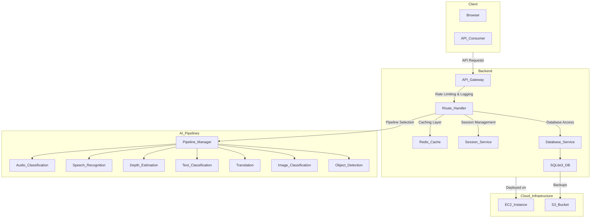

# Sentiment Analysis FastAPI

This project is a simple and efficient Sentiment Analysis API built with FastAPI. It provides endpoints for analyzing the sentiment of text data, categorizing it as positive, negative, or neutral. The API is designed with scalability and modularity in mind, following production-ready practices.

## Project Structure

```bash
sentiment-analysis/
|-- .gitignore
|-- error.log
|-- main.py
|-- requirements.txt
|-- run.cmd
|-- __init__.py
|-- docs/
|   |-- docs.md
|-- models/
|   |-- models.py
|   |-- sentiment.py
|   |-- __init__.py
|-- routers/
|   |-- full_sentiment.py
|   |-- emotion_sentiment.py
|   |-- tone_sentiment.py
|   |-- speech_sentiment.py
|   |-- profession_sentiment.py
|   |-- test_sentiment.py
|   |-- __init__.py
|-- test/
|   |-- output.json
|   |-- sentiment.test.py
```

## API Architectural Diagram





## Requirements

- Python 3.8+
- FastAPI
- Uvicorn
- Tensoflow
- Pytorch
- Transformers

## Installation

1. Clone the repository:

```bash
git clone https://github.com/nexustech101/sentiment-analysis-api.git
cd sentiment-analysis
```

2. Create a virtual environment (optional but recommended):

```bash
python -m venv venv
source venv/bin/activate  # On Linux/Mac
```

or

```bash
python -m venv venv
call venv/Scripts/activate  # On Windows cmd
```

3. Install dependencies:

```bash
pip install -r requirements.txt
```

## Running the API

Start the FastAPI application using Uvicorn:

```bash
uvicorn main:app --reload
```

The API will be accessible at `http://127.0.0.1:8000/v1/api/sentiment`

## API Endpoints

- **GET /** — Root endpoint, returns a welcome message.
- **POST /sentiment** — Analyzes the sentiment of the provided text.
- **Application-type/json** — Post data directly in the body of your request

Request example:

```json
{
  "prompts": [
    "I'm going to teach a lesson on python best practices."
  ]
}
```

Response example:

```json
[
  {
    "sequence": "The new AI model has been making waves in the tech industry.",
    "sentiments": [
      { "label": "technology", "score": 0.831 },
      { "label": "surprise", "score": 0.048 },
      { "label": "statement", "score": 0.034 },
      { "label": "question", "score": 0.029 },
      { "label": "positive", "score": 0.014 },
      { "label": "command", "score": 0.011 },
      { "label": "business", "score": 0.009 },
      { "label": "joy", "score": 0.007 },
      { "label": "neutral", "score": 0.004 },
      { "label": "negative", "score": 0.003 },
      { "label": "fear", "score": 0.002 },
      { "label": "sports", "score": 0.002 },
      { "label": "anger", "score": 0.002 },
      { "label": "education", "score": 0.002 },
      { "label": "politics", "score": 0.001 },
      { "label": "sadness", "score": 0.001 }
    ]
  },
]
```

## Error Logging

Errors are logged in `error.log`. [not included in this repo]

## Documentation

API documentation is automatically available when the server is running:

### Router Prefix

```bash
router = APIRouter(
    prefix="/v1/api"
)
```

### Registered Routes

```bash
# Init FastAPI module
app = FastAPI()

# Register routes with main app router
app.include_router(full_sentiment_route)
app.include_router(emotion_sentiment_route)
app.include_router(tone_sentiment_route)
app.include_router(speech_sentiment_route)
app.include_router(profession_sentiment_route)
```

### Swagger Docs

- Swagger UI: `http://127.0.0.1:8000/docs`
- ReDoc: `http://127.0.0.1:8000/redoc`

### API Docs

- Full Sentiment: `http://127.0.0.1:8000/v1/api/full_sentiment`
- Emotion Sentiment: `http://127.0.0.1:8000/v1/api/emotion_sentiment`
- Tone Sentiment: `http://127.0.0.1:8000/v1/api/tone_sentiment`
- Speech Sentiment: `http://127.0.0.1:8000/v1/api/speech_sentiment`
- Profession Sentiment: `http://127.0.0.1:8000/v1/api/profession_sentiment`

Additional documentation can be found in the `docs/` folder.

## License

This project is licensed under the MIT License.

## Author

Charles DeFreese III
0009-0000-7876-3276
