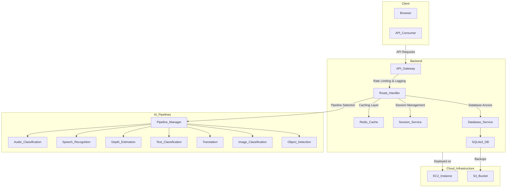

## API Architectural Diagram




Request example:

```json
{
  "prompts": [
    "I'm going to teach a lesson on python best practices."
  ]
}
```

Response example:

```json
[
  {
    "sequence": "The new AI model has been making waves in the tech industry.",
    "sentiments": [
      { "label": "technology", "score": 0.831 },
      { "label": "surprise", "score": 0.048 },
      { "label": "statement", "score": 0.034 },
      { "label": "question", "score": 0.029 },
      { "label": "positive", "score": 0.014 },
      { "label": "command", "score": 0.011 },
      { "label": "business", "score": 0.009 },
      { "label": "joy", "score": 0.007 },
      { "label": "neutral", "score": 0.004 },
      { "label": "negative", "score": 0.003 },
      { "label": "fear", "score": 0.002 },
      { "label": "sports", "score": 0.002 },
      { "label": "anger", "score": 0.002 },
      { "label": "education", "score": 0.002 },
      { "label": "politics", "score": 0.001 },
      { "label": "sadness", "score": 0.001 }
    ]
  },
]
```